# 第2-6章实验结果（重写稿）

说明：本稿对应 `outputs/final_square_validation` 下的最新实验输出。所有扰动图已经改为白底表达：完全不扰动的像素为 `#FFFFFF`，扰动越强颜色越暗；实现上使用

```text
perturbation_map = #FFFFFF - normalized(|attacked - original|)
```

因此读者不会再把黑色背景误解为“额外添加纯黑扰动”。除原图、攻击图、扰动图、mask 图外，新增过程可视化统一采用 `#692F7C, #B43970, #D96558, #EFA143, #F6C63C`，颜色不足时由这 5 个颜色做三次样条插值。含坐标轴的图均为 4:3，Times New Roman，英文坐标标签，无图表标题，并使用 LaTeX 形式标注变量。连续优化方法保存 `process.png`；含外层罚因子或乘子的算法另存 `outer_process.png`。文字攻击保存 `template_trials.png`、`pruning_process.png`，线性化 MILP 另存 `linearization_process.png`。

四张原图的基线决策如下。

| 图片 | 原始类别 | Top-1 score | 决策函数值 |
|---|---|---:|---:|
| `1.png` | sports car | 14.5169 | 0.8022 |
| `2.png` | Persian cat | 9.7289 | 1.6965 |
| `3.png` | Windsor tie | 12.5364 | 0.2301 |
| `4.png` | daisy | 13.1133 | 0.8445 |

## 2.5 实验结果

攻击图、扰动图分别位于：

```text
outputs/final_square_validation/<method>/manual/<image>/attacked.png
outputs/final_square_validation/<method>/manual/<image>/perturbation.png
```

| 方法 | 图片 | 攻击后类别 | 决策函数值 | L2 |
|---|---|---|---:|---:|
| 一阶 Lagrange | `1.png` | convertible | 7.4182 | 3.8236 |
| 一阶 Lagrange | `2.png` | paper towel | 4.8748 | 4.0000 |
| 一阶 Lagrange | `3.png` | groom | 7.9366 | 3.9995 |
| 一阶 Lagrange | `4.png` | handkerchief | 12.6193 | 4.0000 |
| 二阶 KKT | `1.png` | convertible | 7.2838 | 3.8161 |
| 二阶 KKT | `2.png` | paper towel | 4.6844 | 3.9458 |
| 二阶 KKT | `3.png` | groom | 8.1068 | 3.9313 |
| 二阶 KKT | `4.png` | handkerchief | 13.0017 | 4.0000 |

| 方法 | 后端 | 成功率 | 平均耗时/s | 最大耗时/s | 平均决策函数值 | 平均 L2 |
|---|---|---:|---:|---:|---:|---:|
| 一阶 Lagrange | manual | 4/4 | 0.065 | 0.152 | 8.212 | 3.956 |
| 一阶 Lagrange | efficient | 4/4 | 0.062 | 0.139 | 8.212 | 3.956 |
| 二阶 KKT | manual | 4/4 | 63.197 | 74.867 | 8.269 | 3.923 |
| 二阶 KKT | efficient | 4/4 | 63.528 | 74.976 | 8.269 | 3.923 |

### 实验结果分析

第 2 章的两个方法都建立在同一个几何事实上：可行域是以零扰动为中心的二范数闭球，而攻击目标在原图附近可用局部展开来近似。闭球本身具有良好的凸性，但模型输出对应的目标函数并不保证凸，因此结果不能被理解为全局最优证书，而应理解为局部条件所导出的满意候选。四张图均攻击成功，说明原始点到错误分类区域的距离并不大；更重要的是，一阶方法在 `2.png`、`3.png`、`4.png` 上几乎把 L2 推到 4，在 `1.png` 上也达到 3.8236。这表明约束基本处于起作用状态：若把球约束写成 `epsilon^2-||delta||_2^2>=0`，则候选点上的互补关系倾向于由非零乘子承担，而不是由内部驻点承担。换言之，攻击目标沿损失上升方向仍有改进空间，真正限制候选继续移动的是半径边界，而不是梯度自然消失。

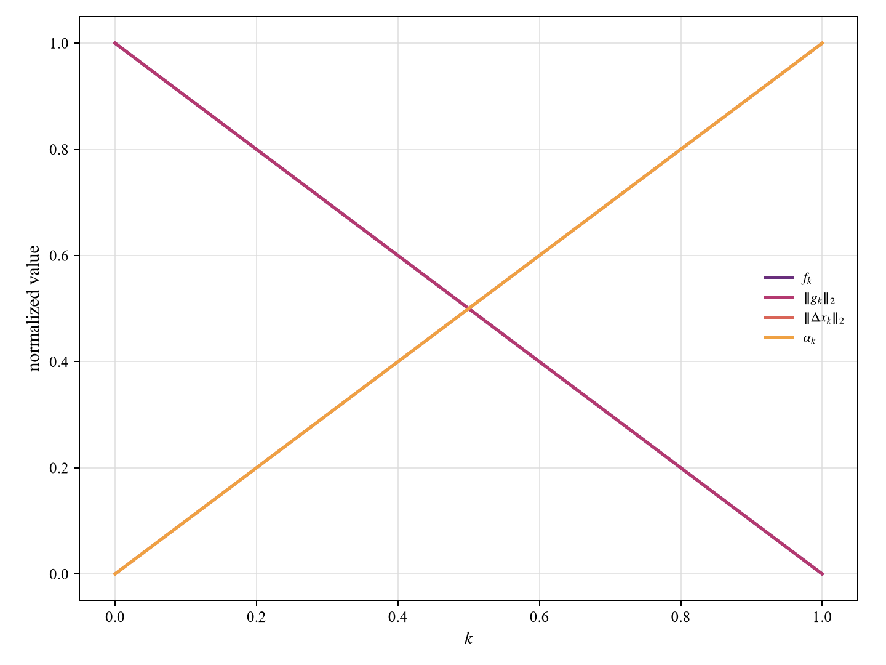

一阶 Lagrange 解的过程图虽然只有从零扰动到球面方向的一次构造，却能说明它的本质：它不是在高维空间中盲目搜索，而是在一阶展开下把方向选为损失梯度的归一化方向，再由半径预算决定步长。这个构造与 Cauchy-Schwarz 等号条件一致，因而在局部线性模型里具有明确的最优意义。它的平均决策函数值为 8.212，已经远高于原图的 0.2301 到 1.6965，说明局部一阶方向足以穿越分类边界并留下余量。由于只需一次反向求导，manual 与 efficient 后端耗时几乎一致，分别为 0.065 秒和 0.062 秒；这说明主要计算瓶颈不在求解器迭代，而在一次模型梯度计算。

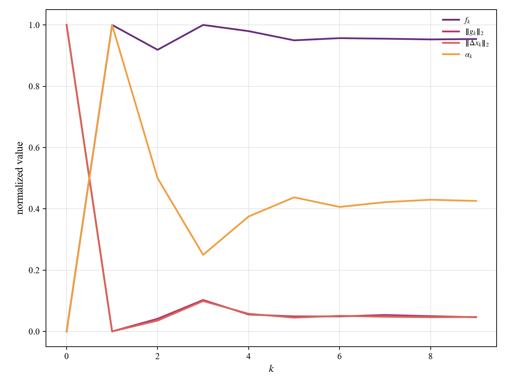

二阶 KKT 近似的平均 L2 为 3.923，略低于一阶方法的 3.956，说明 Hessian 向量积确实对方向作了修正，使候选点在局部二次模型中不必完全沿一阶梯度走到最外侧。不过它的平均决策函数值只从 8.212 提高到 8.269，提升幅度很小，而耗时从 0.065 秒上升到 63.197 秒。这个对比揭示了一个关键取舍：二阶信息提高的是局部曲率刻画能力，却不一定显著改善真实非凸模型上的攻击效果。过程图中残差范数、候选范数与乘子变化一起出现，反映出该方法实际在寻找满足 `(2 lambda I-H)delta=g` 和球半径条件的折中点；当 Hessian 不正定或局部二次模型与真实函数偏离时，乘子搜索提供的是必要条件附近的候选，而不是充分性保证。因而，第 2 章最值得强调的结论不是“二阶一定更好”，而是：一阶方向给出极高性价比，二阶方法给出更完整的驻点结构解释，两者共同说明攻击成功主要受边界约束支配。

## 3.3 实验结果

| 方法 | 后端 | 成功率 | 平均耗时/s | 最大耗时/s | 平均决策函数值 | 平均 L2 |
|---|---|---:|---:|---:|---:|---:|
| 加权和-最速下降 | manual | 4/4 | 1.593 | 1.797 | 104.374 | 10.099 |
| 加权和-最速下降 | efficient | 4/4 | 3.993 | 4.015 | 118.734 | 7.170 |
| 加权和-牛顿法 | manual | 4/4 | 48.375 | 58.348 | 101.527 | 9.656 |
| 加权和-牛顿法 | efficient | 4/4 | 3.985 | 4.081 | 118.734 | 7.170 |
| 加权和-LM 修正 | manual | 4/4 | 54.056 | 68.386 | 99.576 | 9.184 |
| 加权和-LM 修正 | efficient | 4/4 | 3.978 | 4.011 | 118.734 | 7.170 |
| 加权和-DFP | manual | 4/4 | 1.280 | 1.407 | 102.767 | 24.117 |
| 加权和-DFP | efficient | 4/4 | 3.959 | 3.999 | 118.734 | 7.170 |
| 加权和-FR 共轭梯度 | manual | 4/4 | 1.928 | 2.064 | 99.253 | 23.316 |
| 加权和-FR 共轭梯度 | efficient | 4/4 | 3.976 | 4.024 | 118.734 | 7.170 |
| 加权和-PR+ 共轭梯度 | manual | 4/4 | 11.437 | 16.529 | 103.915 | 20.895 |
| 加权和-PR+ 共轭梯度 | efficient | 4/4 | 3.993 | 4.065 | 118.734 | 7.170 |
| Courant 外点罚函数 | manual | 4/4 | 0.985 | 1.115 | 5.822 | 0.469 |
| Courant 外点罚函数 | efficient | 4/4 | 4.730 | 7.859 | 5.001 | 0.189 |
| Softplus 外点罚函数 | manual | 4/4 | 1.908 | 4.798 | 6.473 | 0.415 |
| Softplus 外点罚函数 | efficient | 4/4 | 11.692 | 15.868 | 5.516 | 0.200 |
| 二范数球投影梯度 | manual | 4/4 | 1.163 | 1.268 | 79.348 | 3.999 |
| 二范数球投影梯度 | efficient | 4/4 | 1.161 | 1.298 | 79.348 | 3.999 |

### 实验结果分析

第 3 章的结果必须分成三类理解。第一类是加权和无约束模型，它把“扰动尽量小”和“攻击尽量强”压入同一个标量目标。这里的权重相当于在两个偏差之间规定交换比例：一旦攻击收益的权重足够大，求解器宁愿牺牲扰动规模，也要继续增加决策函数。表中最速下降、牛顿、LM、DFP、FR、PR+ 全部成功，平均决策函数普遍在 99 以上，远高于外点法的阈值附近结果。这并不意味着它们更“精细”，而是说明加权和模型给出的往往是攻击余量很大的可行点；其中 manual DFP、FR、PR+ 的平均 L2 超过 20，正是软约束模型过度追求攻击收益的表现。若把攻击阈值看成目标值，则这些方法大量惩罚了“不足偏差”，却没有直接惩罚“超过目标太多”的正偏差，因而容易越过边界很远。

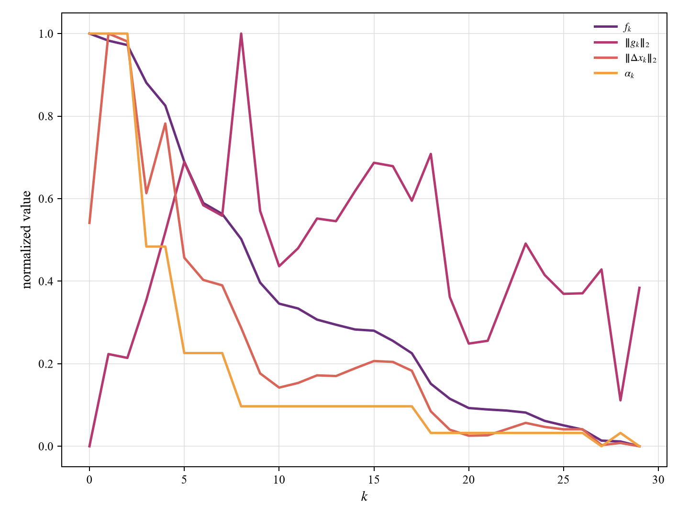

最速下降的过程图体现了下降迭代法的基本结构：每一步用当前梯度给出下降方向，再通过近似一维搜索选择 `alpha_k`。在高维图像上，梯度方向计算便宜，但方向只利用一阶信息，容易出现“目标值下降很快、扰动也随之快速增大”的现象。manual 最速下降平均耗时 1.593 秒，平均 L2 为 10.099，说明它以较低代价得到强攻击，但并未主动寻找最小扰动边界。牛顿法和 LM 修正使用二阶局部模型，manual 平均耗时分别升到 48.375 秒和 54.056 秒；LM 的平均 L2 为 9.184，低于普通牛顿法的 9.656，说明当 Hessian 可能不正定或病态时，把二阶矩阵修正为更稳定的下降结构可以减少不必要的偏移。不过二者的决策函数值并没有超过一阶方法，说明真实目标的非凸和分段结构会削弱二阶模型的优势。

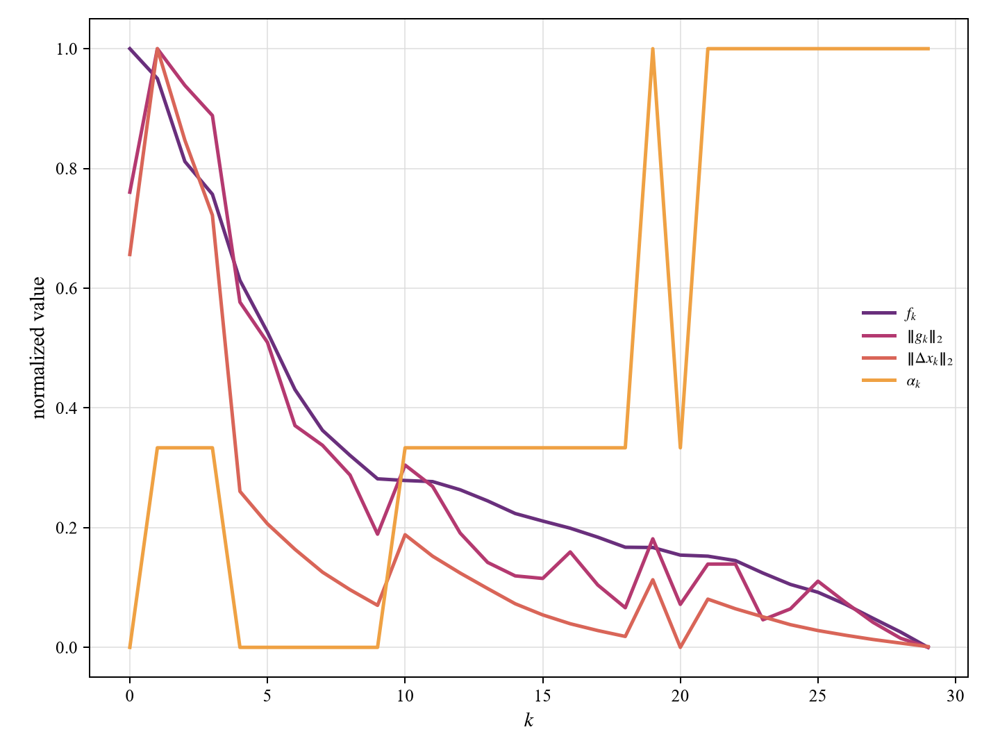

DFP 与共轭梯度的表现进一步说明“方向质量”与“模型目标”不能混为一谈。DFP 试图逐步逼近 Hessian 逆矩阵的作用，共轭梯度试图构造相互共轭的搜索方向；这些性质在严格二次目标上非常有力，但神经网络目标并非固定二次型，因此共轭性只能作为近似加速机制。manual DFP 平均耗时仅 1.280 秒，却产生 24.117 的平均 L2，说明其搜索方向在加权目标上很有效，但也把解推得很远。PR+ 通过自动重置避免方向失去下降性，平均 L2 降为 20.895，但耗时增至 11.437 秒，显示重置带来稳定性，同时增加了检查和搜索代价。efficient 后端对加权和模型的多个算法给出相同统计，是因为它们统一调用同一高效拟牛顿后端；这可作为同一数学模型在不同实现策略下的参照，而不应误读为这些手写方向完全等价。

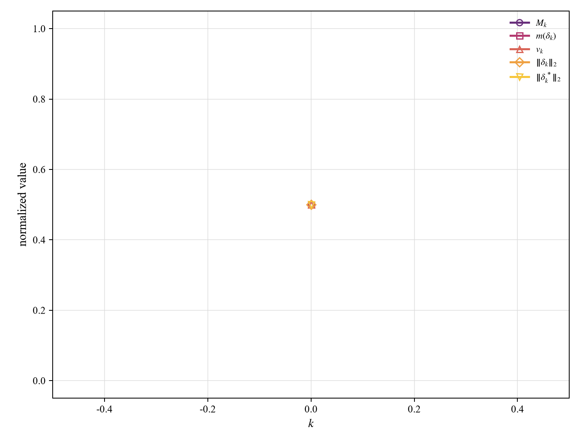

第二类是外点罚函数模型。它与加权和模型的差别非常明显：目标不再是“攻击越强越好”，而是在攻击损失达到阈值后压缩扰动。manual Courant 外点法平均决策函数为 5.822，efficient 为 5.001，均靠近阈值 5；对应平均 L2 只有 0.469 和 0.189。外层过程图显示罚因子上升时，约束违反量被逐步压低，候选点从不可行侧逼近可行边界。Softplus 光滑版本把 `max(eta-J,0)` 替换为平滑近似，因此在满足约束后仍会保留小的惩罚项；这解释了它的平均决策函数略高于 Courant 外点法，同时 L2 仍很小。第三类是投影梯度法，它每步都把候选投回二范数球，最终平均 L2 接近 4，决策函数值达到 79.348。它说明“保持原始可行”与“最小扰动”不是同一件事：投影保证半径预算不被突破，却不会自动停在刚好攻击成功的位置。三类方法合在一起表明，建模方式比求解器名称更深刻地决定了解的形态。

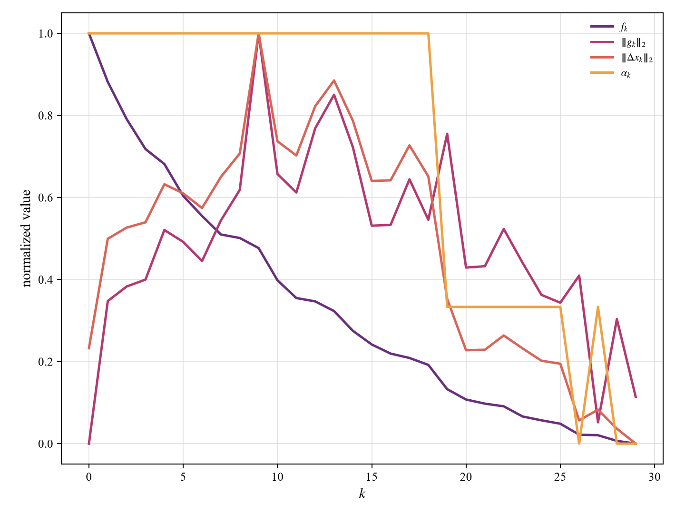

## 4.5 实验结果

| 图片 | 攻击后类别 | 决策函数值 | L2 |
|---|---|---:|---:|
| `1.png` | convertible | 32.5530 | 2.4810 |
| `2.png` | paper towel | 106.1599 | 3.7515 |
| `3.png` | military uniform | 96.3133 | 3.2799 |
| `4.png` | handkerchief | 59.1491 | 3.0299 |

| 方法 | 后端 | 成功率 | 平均耗时/s | 最大耗时/s | 平均决策函数值 | 平均 L2 |
|---|---|---:|---:|---:|---:|---:|
| 对偶损失双层迭代 | manual | 4/4 | 8.672 | 8.965 | 73.544 | 3.136 |
| 对偶损失双层迭代 | efficient | 4/4 | 16.121 | 16.219 | 85.648 | 3.164 |

### 实验结果分析

第 4 章的双层迭代可以从“原始候选”和“乘子权重”两条线同时理解。原始问题希望在攻击损失达到阈值后使扰动范数尽量小；引入乘子后，内层问题变成 `||delta||_2^2-lambda J(x+delta,y)`，也就是在固定 `lambda` 下平衡扰动成本与攻击收益。外层根据当前攻击度量与阈值之间的差值更新 `lambda`：不足时提高乘子，让下一次内层更重视增大攻击损失；超过时允许乘子回落，让搜索重新关注扰动代价。这与单纯把权重固定住的加权和模型不同，乘子在这里是随约束紧张程度变化的调节量。四张图全部成功，manual 平均 L2 为 3.136，低于投影梯度的 3.999，也远低于多数加权和方法，说明动态乘子确实能把候选保持在较小扰动范围内。

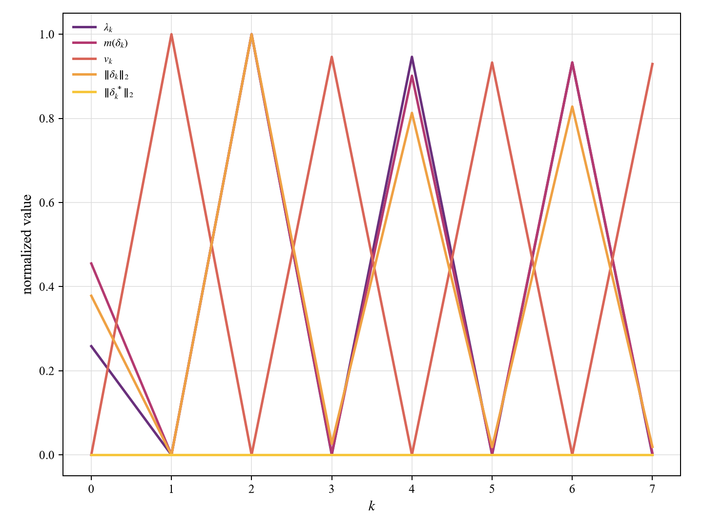

外层过程图显示的不是普通目标函数下降曲线，而是乘子、当前度量、扰动范数和已保留可行候选的共同演化。这个记录很重要，因为双层迭代的最终输出并不一定取最后一次内层点，而是从历次可行候选中保留扰动较小者。这样的策略类似在搜索过程中维护一个“当前最好可行解”：内层允许在非凸地形里产生不同局部点，外层不断改变乘子，使候选群逐渐覆盖可行边界附近。manual 后端平均决策函数为 73.544，efficient 为 85.648，两者 L2 接近，说明 efficient 版本在相似扰动规模下找到了攻击余量更大的点；但若目标是最小扰动，过大的余量并不一定更优，它只是说明该点离阈值边界更远。

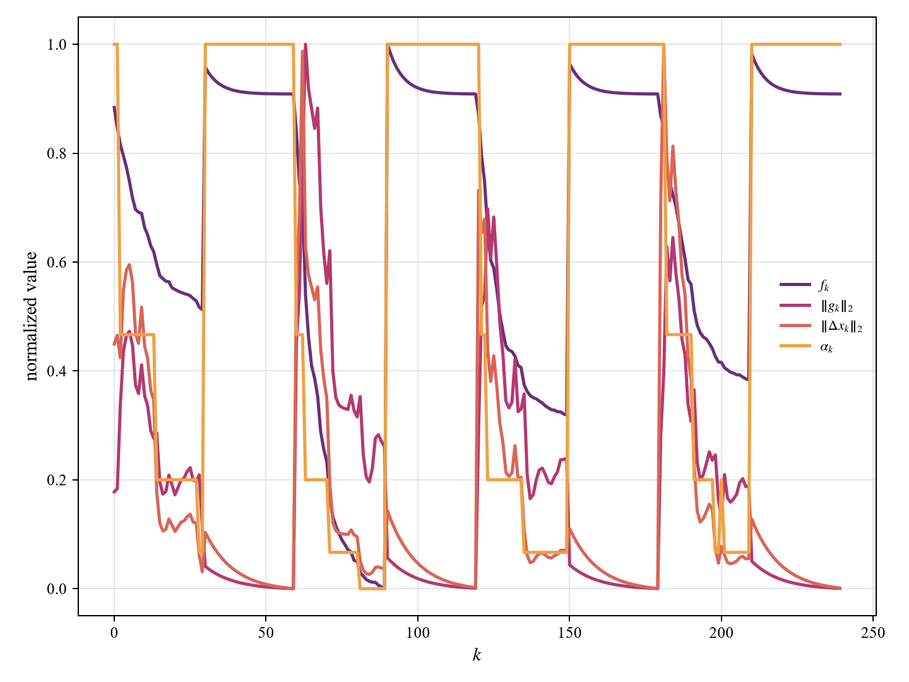

从各样本看，`2.png` 和 `3.png` 的决策函数值分别达到 106.1599 和 96.3133，明显高于 `1.png` 的 32.5530。结合基线决策函数，`2.png` 原始损失本就较高，说明原图对原类别的稳定性相对弱，乘子稍加放大就能把它推到错误区域深处；`1.png` 的扰动范数较低而余量较小，表现为更接近阈值边界的候选。需要强调的是，由于内层目标仍然非凸，双层过程不能被当成强对偶成立时的全局证明。它更像一种带反馈的满意解搜索：乘子给出攻击阈值的边际压力，内层下降给出当前压力下的原始候选，历史保留机制避免把较小扰动的可行点丢失。这个结构使第 4 章比单纯无约束下降更稳健，也比固定阈值投影更能解释“为什么某个候选值得保留”。

## 5.3 实验结果

| 图片 | 攻击后类别 | 定向间隔 | L2 |
|---|---|---:|---:|
| `1.png` | toilet tissue | 12.2494 | 2.0767 |
| `2.png` | toilet tissue | 0.1049 | 0.0786 |
| `3.png` | toilet tissue | 24.7378 | 2.5877 |
| `4.png` | toilet tissue | 9.0448 | 1.8462 |

| 方法 | 后端 | 成功率 | 平均耗时/s | 最大耗时/s | 平均定向间隔 | 平均 L2 |
|---|---|---:|---:|---:|---:|---:|
| 定向 toilet tissue 攻击 | manual | 4/4 | 10.344 | 10.944 | 11.534 | 1.647 |
| 定向 toilet tissue 攻击 | efficient | 4/4 | 17.789 | 18.129 | 20.713 | 2.044 |

### 实验结果分析

第 5 章把“离开原类别”改成“进入指定类别”，约束结构因此更强。非定向攻击只要求某个错误类别超过原类别；定向攻击则要求 `toilet tissue` 类别超过所有其他类别，并且间隔不低于 0.1。这个间隔函数包含最大值项，本身是分段结构：当前最强竞争类别一旦改变，局部梯度方向也会切换。因此，实验结果不能只看成功率，而要看定向间隔和 L2 的组合。manual 后端四张图全部成功，平均 L2 为 1.647，低于第 4 章非定向双层的 3.136，表面上看似“更强约束反而更小扰动”，实际说明指定类别在模型特征空间中并不一定远离所有原图；对某些图像而言，`toilet tissue` 方向可能正好是较容易进入的错误区域。

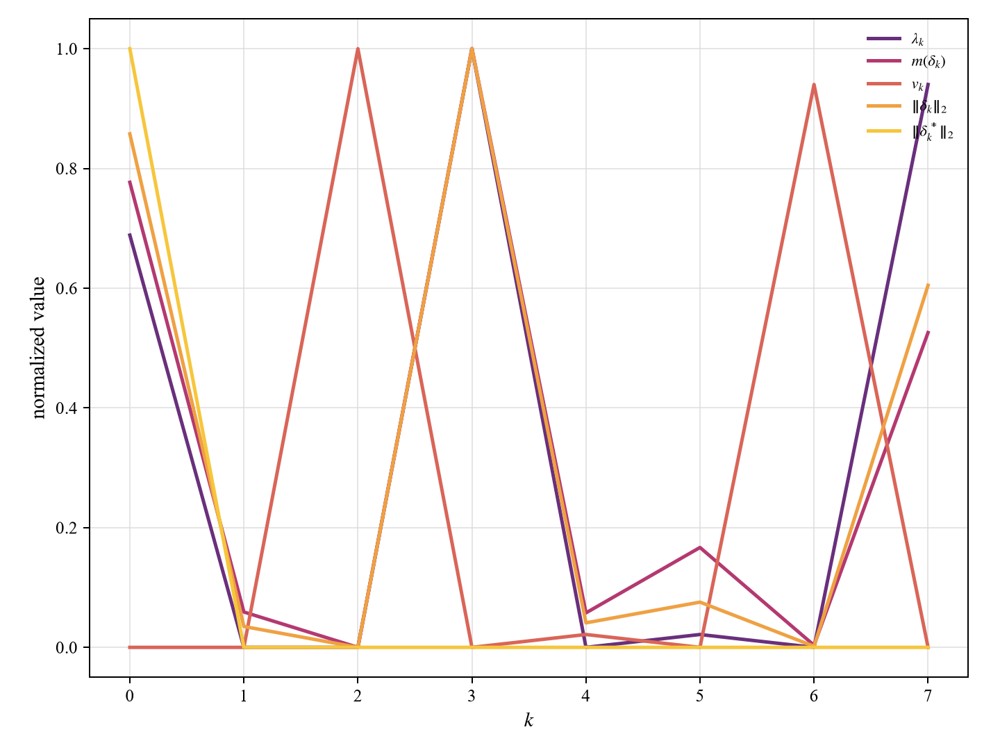

`2.png` 是最典型的边界样本。它只需要 L2=0.0786，就使定向间隔达到 0.1049，几乎贴着阈值 0.1。这种结果说明该图像原始点附近已经存在通往指定类别的很窄通道，乘子外层只需把候选推过边界即可。过程图中，乘子和候选范数的变化体现出一种“刚好可行”的搜索状态：当间隔不足时，乘子增大；一旦出现满足阈值且范数很小的候选，该候选被保留下来，即使后续迭代可能找到更大间隔的点，也不一定取代它。与之相对，`3.png` 的定向间隔达到 24.7378，L2 为 2.5877，说明在温莎结图像上，当前搜索更容易沿指定目标方向深入，而不是停在阈值附近。

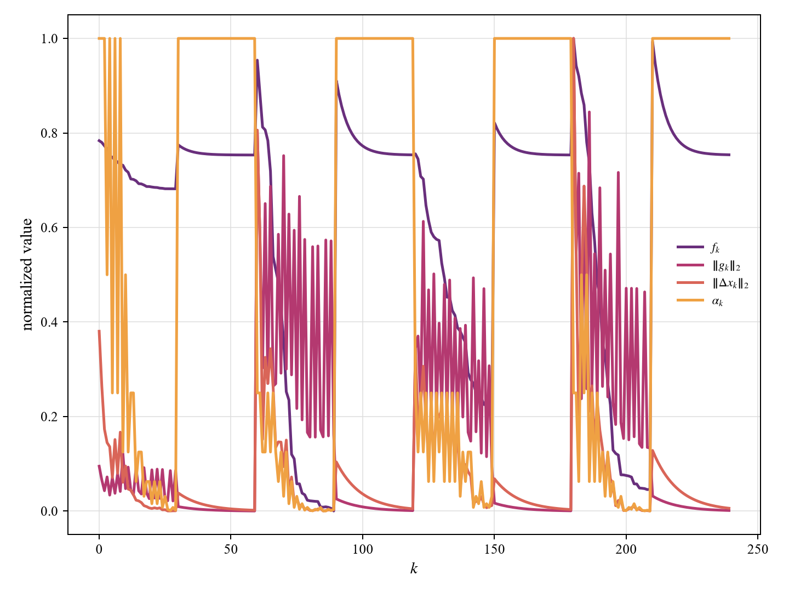

从建模角度看，本章更接近带优先级的目标协调：第一层要求指定类别取得正间隔，这是必须满足的目标；第二层才是压缩扰动范数。若把这两个目标简单相加，可能会像加权和方法那样追求过大的间隔；本章沿用双层乘子策略，能够在“达到定向目标”和“保留较小扰动”之间动态调整。manual 后端平均间隔 11.534、平均 L2 1.647；efficient 后端平均间隔升到 20.713、平均 L2 也升到 2.044，正说明更强的内层搜索会倾向于得到余量更大的可行点，但代价是扰动略增。两者的差异不是谁绝对更好，而是偏好不同：manual 更偏向接近满意边界，efficient 更偏向取得安全余量。定向攻击的深层结论是，指定目标约束改变了可行区域的形状，某些样本会出现极小扰动的边界解，而另一些样本则会沿目标间隔方向被推入较深区域。

## 6.3 实验结果

文字攻击的攻击图、扰动图和 mask 分别位于：

```text
outputs/final_square_validation/text_<method>/manual/<image>/attacked.png
outputs/final_square_validation/text_<method>/manual/<image>/perturbation.png
outputs/final_square_validation/text_<method>/manual/<image>/mask.png
```

| 方法 | 图片 | 攻击后类别 | 决策函数值 | L2 | 面积 |
|---|---|---|---:|---:|---:|
| 反向贪心 | `1.png` | convertible | 0.1450 | 6.2661 | 37 |
| 反向贪心 | `2.png` | Angora | 0.1115 | 10.7757 | 57 |
| 反向贪心 | `3.png` | oboe | 0.2671 | 10.3281 | 156 |
| 反向贪心 | `4.png` | handkerchief | 0.1895 | 7.4769 | 34 |
| 线性化 MILP | `1.png` | convertible | 0.1045 | 6.4599 | 40 |
| 线性化 MILP | `2.png` | Angora | 0.1532 | 10.5717 | 56 |
| 线性化 MILP | `3.png` | oboe | 1.6098 | 14.9709 | 344 |
| 线性化 MILP | `4.png` | handkerchief | 0.1895 | 7.4769 | 34 |

| 方法 | 后端 | 成功率 | 平均耗时/s | 最大耗时/s | 平均决策函数值 | 平均 L2 | 平均面积 |
|---|---|---:|---:|---:|---:|---:|---:|
| 反向贪心剪枝 | manual | 4/4 | 181.872 | 393.568 | 0.178 | 8.712 | 71.0 |
| 反向贪心剪枝 | efficient | 4/4 | 180.054 | 387.600 | 0.178 | 8.712 | 71.0 |
| 一阶线性化 MILP | manual | 4/4 | 453.820 | 843.859 | 0.514 | 9.870 | 118.5 |
| 一阶线性化 MILP | efficient | 4/4 | 14.583 | 30.528 | 0.139 | 10.182 | 121.5 |

### 实验结果分析

第 6 章与前几章的连续扰动完全不同。这里的决策变量不是每个像素可以连续改变多少，而是文字模板内的像素是否被置黑，因此变量天然是 0-1 型；同时，一个像素能否保留不能只看局部攻击收益，还要看它是否破坏笔画连通性。把图像看成四邻域格点图后，每个候选文字像素是顶点，上下左右相邻关系是边；每个笔画必须在被保留顶点诱导的子图中连通。这个约束不是普通线性不等式能直接表达的，所以程序用单源辅助流来验证：根顶点向其他被选顶点输送单位流，只有所有被选顶点都能接收流量时，笔画结构才被认为连通。这一设计把“看起来像字”的直观要求转化为可检验的网络可行性。

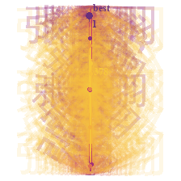

模板尝试图把历次候选“张天羽”叠在同一张图上，颜色由早到晚渐变，并标记最终选中模板。它不是装饰图，而是展示候选搜索顺序：字号、位置、旋转角度共同决定模板面积、覆盖区域和初始攻击间隔。反向贪心在四张图上平均面积为 71.0，低于线性化 MILP 的 118.5/121.5，说明从完整可行模板出发再逐步删点，可以更细致地压缩面积。`1.png` 和 `4.png` 分别只需 37 和 34 个像素，说明在这些图像上，少量结构化置黑点就能改变分类；`3.png` 需要 156 个像素，表明温莎结样本对这类文字遮挡更不敏感，必须保留更大结构才能达到阈值。

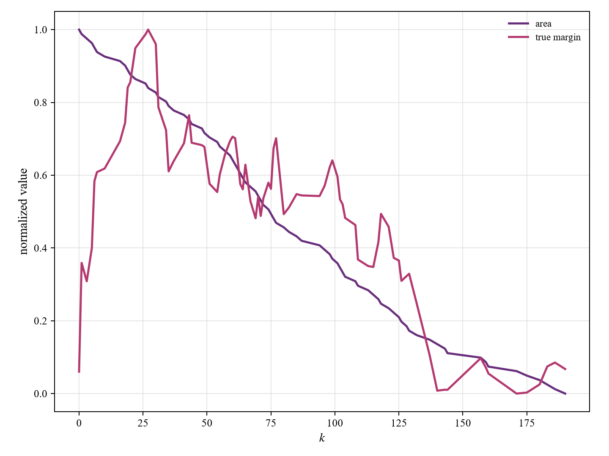

反向贪心的剪枝曲线揭示了它的求解逻辑：横轴是删除检查次数，纵向同时归一化面积和真实间隔。每次尝试删除一个边际收益较低的像素后，算法必须重新检查三件事：攻击间隔是否仍不低于 0.1，笔画保留率是否满足，辅助流是否还能证明连通。只有三者同时成立，删除才被接受。这类似在一张剩余网络中不断判断是否还存在可行通路；一旦某个删除使笔画分裂，结构证书消失，即使它能减少面积也不能接受。因此，反向贪心得到的面积小，但耗时较高，manual 平均 181.872 秒，`4.png` 达到 393.568 秒。耗时不是单纯来自排序，而是来自反复调用真实模型与图结构检验。

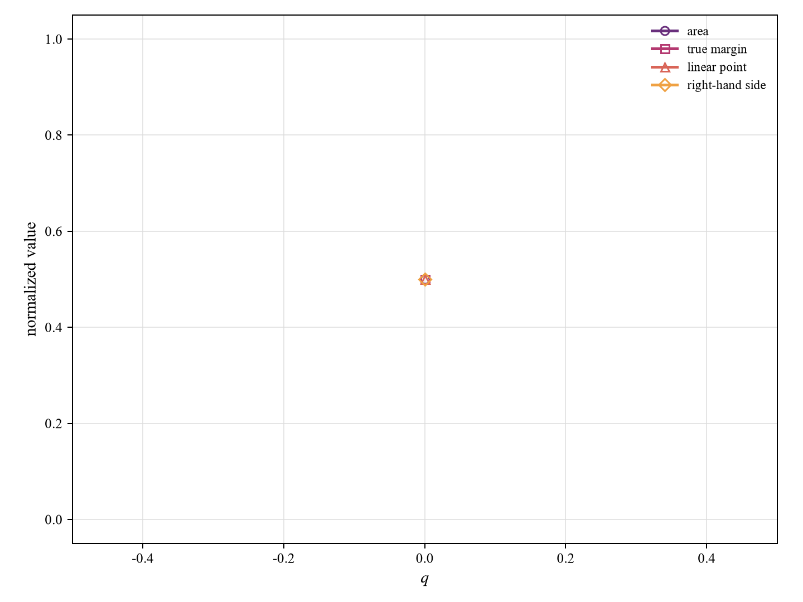

线性化 MILP 的思想则是先在当前掩码附近用一阶展开近似攻击约束，把神经网络约束转成线性收益不等式，再与面积目标、保留率约束和辅助流约束一起求解。`linearization_process.png` 展示了参考间隔、右端项、候选面积和真实检验间隔的变化，说明它并不相信一次线性化就是最终答案，而是每轮都回到原模型验证。manual 版本在 `3.png` 上保留 344 个像素，决策函数达到 1.6098，明显超过阈值，表现出保守性：局部线性模型为了确保真实约束可行，宁愿保留更多像素。efficient 版本平均耗时仅 14.583 秒，面积 121.5，与 manual 的 118.5 接近，说明混合整数求解器在固定线性近似下能更快找到整数可行方案。第 6 章最重要的结论是：面积最小文字攻击不是普通像素排序问题，而是攻击收益、0-1 面积、模板保真和网络连通四类约束同时作用的组合问题；反向贪心偏向局部压缩面积，线性化 MILP 偏向先建立全局线性可行框架再验证真实模型，两者互补地展示了结构化攻击的求解过程。
